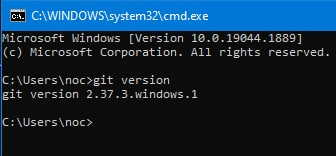
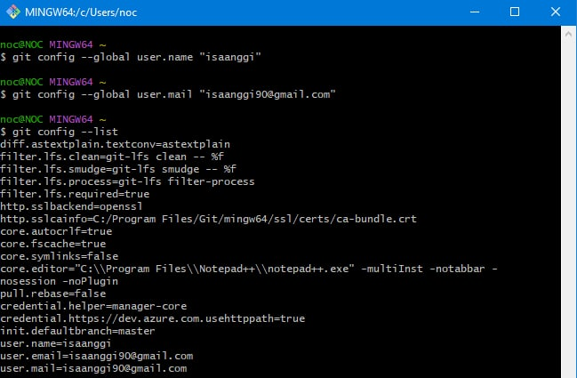
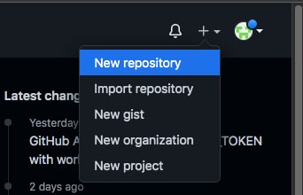
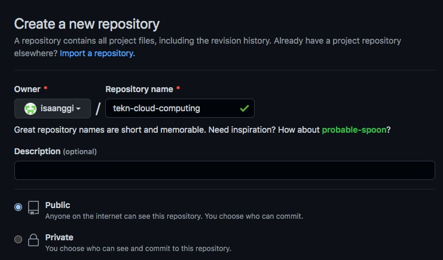

# Instalasi Git

## Windows

Sebelumnya saya sudah pernah menginstal Git di Windows, sehingga saat ini hanya melakukan cek versi saja.

# Konfigurasi Git
Ada 2 hal yang perlu dikonfigurasi yaitu username dan email. Konfigurasi harus disesuaikan dengan nama serta email yang digunakan untuk mendaftar di GitHub. Dengan cara sebagai berikut:

# Mengelola Repo Sendiri di Account Sendiri
## Membuat Repo

1. Buka web [Github] (https://github.com/). kemudian masuk ke akun untuk membuat repository baru.

2.	Membuat repository baru dengan nama tekn-cloud-computing, jika sudah selesai klik create repository.

3. Maka akan muncul repo baru

4. Setelah langkah-langkah tersebut, repo akan dibuat dan bisa diakses menggunakan pola https://github.com/username/reponame

