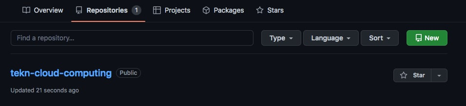
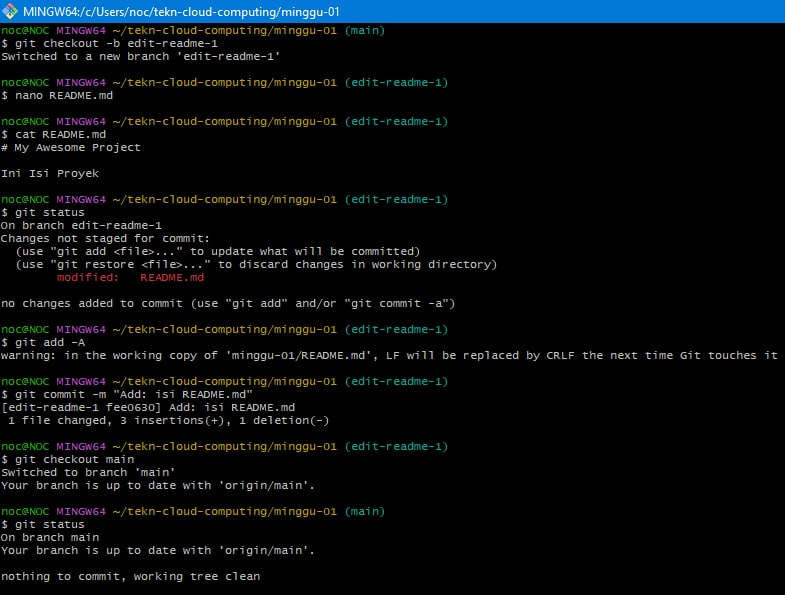

# Instalasi Git

## Windows

Sebelumnya saya sudah pernah menginstal Git di Windows, sehingga saat ini hanya melakukan cek versi saja.

# Konfigurasi Git
Ada 2 hal yang perlu dikonfigurasi yaitu username dan email. Konfigurasi harus disesuaikan dengan nama serta email yang digunakan untuk mendaftar di GitHub. Dengan cara sebagai berikut:

# Mengelola Repo Sendiri di Account Sendiri
## Membuat Repo

1. Buka web [Github] (https://github.com/). kemudian masuk ke akun untuk membuat repository baru.

2.	Membuat repository baru dengan nama tekn-cloud-computing, jika sudah selesai klik create repository.

3. Maka akan muncul repo baru

4. Setelah langkah-langkah tersebut, repo akan dibuat dan bisa diakses menggunakan pola https://github.com/username/reponame

## Clone repository

Proses clone adalah proses untuk menduplikasikan remote repo di GitHub ke komputer lokal. Untuk melakukan proses clone dengan cara sebagai berikut:

Setelah perintah ini, di direktori tekn-cloud-computing akan disimpan isi repo yang sama dengan di GitHub. Perbedaannya, di komputer lokal terdapat direktori .git yang digunakan secara internal oleh Git.

# Mengelola Repo

### Mengubah Isi - Push Tanpa Branching dan Merging

Perubahan isi bisa terjadi karena satu atau kombinasi beberapa hal berikut:
1.	File dihapus
2.	File diedit
3.	Membuat file / direktori baru
4.	Menghapus direktori

Untuk kasus-kasus tersebut, lakukan perubahan di komputer lokal, setelah itu push ke repo.

### Mengubah Isi dengan Branching and Merging

1.	Buat branch untuk menampung perubahan-perubahan
2.	Lakukan perubahan-perubahan
3.	Add dan commit perubahan-perubahan tersebut ke branch
4.	Kembali ke repo master
5.	Buat pull request di GitHub
6.	Merge pull request di GitHub
7.	Merge branch untuk menampung perubahan-perubahan tersebut ke master.
8.	Selesai.

### Membuat pull request kemudian merge pull

### Sinkronisasi

