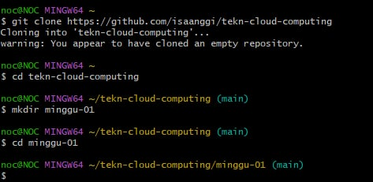

# Instalasi Git

## Windows

Sebelumnya saya sudah pernah menginstal Git di Windows, sehingga saat ini hanya melakukan cek versi saja.


# Konfigurasi Git
Ada 2 hal yang perlu dikonfigurasi yaitu username dan email. Konfigurasi harus disesuaikan dengan nama serta email yang digunakan untuk mendaftar di GitHub. Dengan cara sebagai berikut:


# Mengelola Repo Sendiri di Account Sendiri
## Membuat Repo

1. Buka web [Github] (https://github.com/). kemudian masuk ke akun untuk membuat repository baru.


2.	Membuat repository baru dengan nama tekn-cloud-computing, jika sudah selesai klik create repository.


3. Maka akan muncul repo baru


4. Setelah langkah-langkah tersebut, repo akan dibuat dan bisa diakses menggunakan pola https://github.com/username/reponame


## Clone repository

Proses clone adalah proses untuk menduplikasikan remote repo di GitHub ke komputer lokal. Untuk melakukan proses clone dengan cara sebagai berikut:



Setelah perintah ini, di direktori tekn-cloud-computing akan disimpan isi repo yang sama dengan di GitHub. Perbedaannya, di komputer lokal terdapat direktori .git yang digunakan secara internal oleh Git.

# Mengelola Repo

### Mengubah Isi - Push Tanpa Branching dan Merging

Perubahan isi bisa terjadi karena satu atau kombinasi beberapa hal berikut:
1.	File dihapus
2.	File diedit
3.	Membuat file / direktori baru
4.	Menghapus direktori

Untuk kasus-kasus tersebut, lakukan perubahan di komputer lokal, setelah itu push ke repo.


### Mengubah Isi dengan Branching and Merging

1.	Buat branch untuk menampung perubahan-perubahan
2.	Lakukan perubahan-perubahan
3.	Add dan commit perubahan-perubahan tersebut ke branch
4.	Kembali ke repo master
5.	Buat pull request di GitHub
6.	Merge pull request di GitHub
7.	Merge branch untuk menampung perubahan-perubahan tersebut ke master.
8.	Selesai.


### Membuat pull request kemudian merge pull


### Sinkronisasi


### Membatalkan Perubahan


### Undo Commit Terakhir

Suatu saat, mungkin kita sudah terlanjur mem-push perubahan ke repo GitHub, setelah itu kita baru menyadari bahwa perubahan tersebut salah. Untuk itu, kita bisa melakukan git revert.


Contoh di atas adalah contoh untuk mengubah README.md dengan beberapa commit. Setelh itu, kita akan mengembalikan ke posisi terakhir sebelum commit terakhir.

Saat git revert HEAD maka akan terbuka Editor. Pada editor tersebut kita bisa mengetikkan pesan revert ( = pesan commit untuk pembatalan). Setelah selesai, simpan lalu push ke repo.


Jika commit sudah dilakukan, tetapi belum di-push ke repo GitHub (masih berada di lokal), cara membatalkannya:


Untuk kembali ke perubahan pada saat yang sudah lama, yang perlu dilakukan adalah melakukan ```git revert <posisi>``` kemudian mengedit secara manual kemudian push ke repo. Contohnya disini Saya membuat beberapa kali perubahan pada README.md:


Setelah itu, jika dilihat pada file, akan muncul tambahan untuk memudahkan meng-edit. File ini harus di-resolve terlebih dahulu. Edit file tersebut, setelah itu simpan.


Setelah itu, lanjutkan proses revert. Saat ```git revert --continue``` akan muncul Editor kembali lalu isikan pesan revert.


