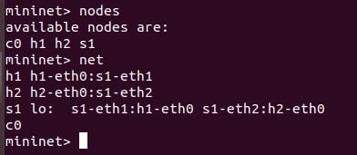
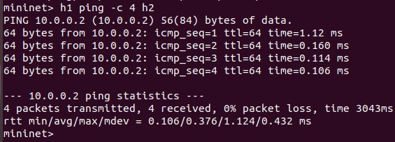

# Mininet Walkthrough on Ubuntu
### Step 1: Install
Login, install net-tools, git clone and install Mininet on your Ubuntu system.
```bash
osboxes@isaanggi:~$ sudo apt-get install net-tools
osboxes@isaanggi:~$ git clone https://github.com/mininet/mininet
osboxes@isaanggi:~$ mininet/util/install.sh -w
osboxes@isaanggi:~$ mininet/util/install.sh -a
```
Wait until the installation is complete.
### Step 2: Minimal Topology
Start a minimal topology and enter the CLI:<br>
<br>
The default topology is the minimal topology, which includes one OpenFlow kernel switch connected to two hosts, plus the OpenFlow reference controller.
### Step 3: Interact with Hosts and Switches
Display Mininet CLI commands:<br>
<br>
Display nodes and links:<br>
<br>
Dump information about all nodes:<br>
<br>
Run a command on a host process:<br>
<br>
<br>
Print the process list from a host process:<br>
<br>
<br>
Now, verify that you can ping from host 0 to host 1:<br>
<br>
An easier way to run this test is to use the Mininet CLI built-in pingall command, which does an all-pairs ping:<br>
<br>
Exit the CLI:<br>
<br>
If Mininet crashes for some reason, clean it up:<br>
<br>


