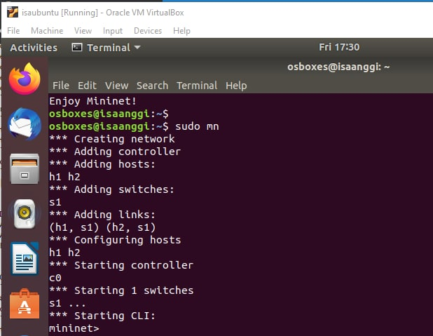
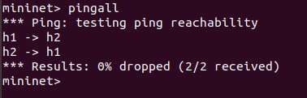

# Mininet Walkthrough on Ubuntu
### Step 1: Install
Login, install net-tools, git clone and install Mininet on your Ubuntu system.
```bash
osboxes@isaanggi:~$ sudo apt-get install net-tools
osboxes@isaanggi:~$ git clone https://github.com/mininet/mininet
osboxes@isaanggi:~$ mininet/util/install.sh -w
osboxes@isaanggi:~$ mininet/util/install.sh -a
```
Wait until the installation is complete.
### Step 2: Minimal Topology
Start a minimal topology and enter the CLI:

The default topology is the minimal topology, which includes one OpenFlow kernel switch connected to two hosts, plus the OpenFlow reference controller.
### Step 3: Interact with Hosts and Switches
Display Mininet CLI commands:

Display nodes and links:

Dump information about all nodes:

Run a command on a host process:


Print the process list from a host process:


Now, verify that you can ping from host 0 to host 1:

An easier way to run this test is to use the Mininet CLI built-in pingall command, which does an all-pairs ping:

Exit the CLI:

If Mininet crashes for some reason, clean it up:


