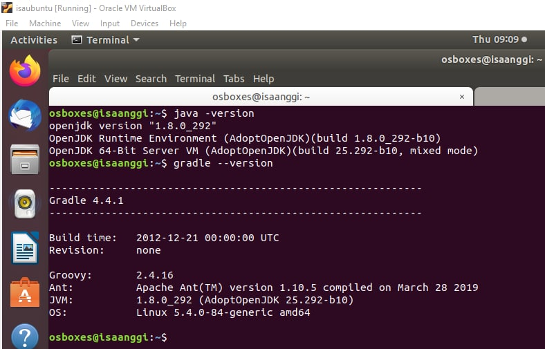
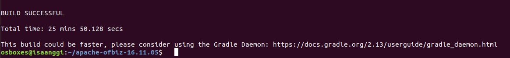
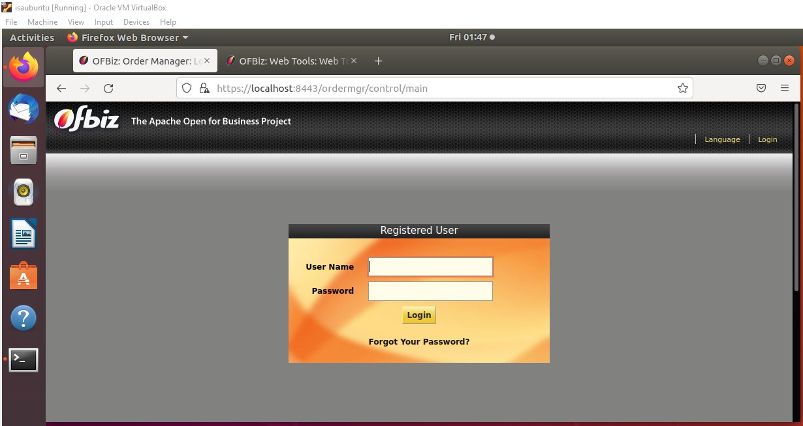
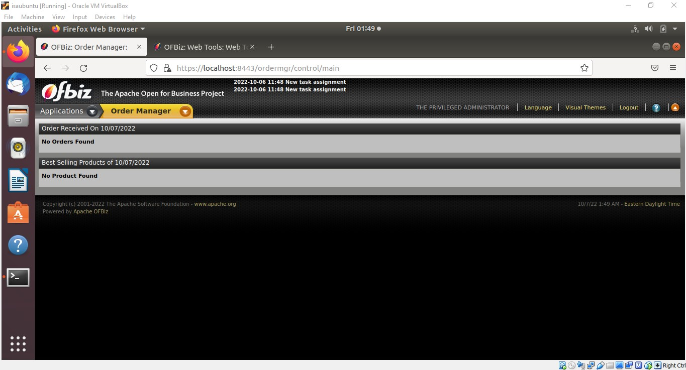
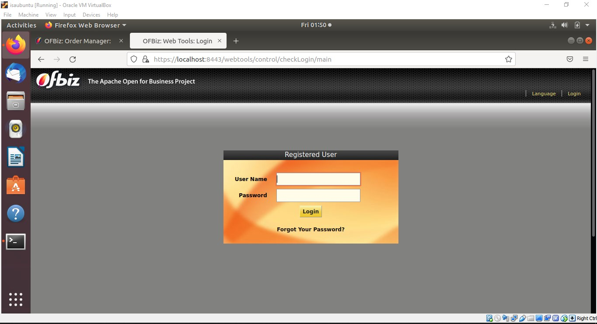
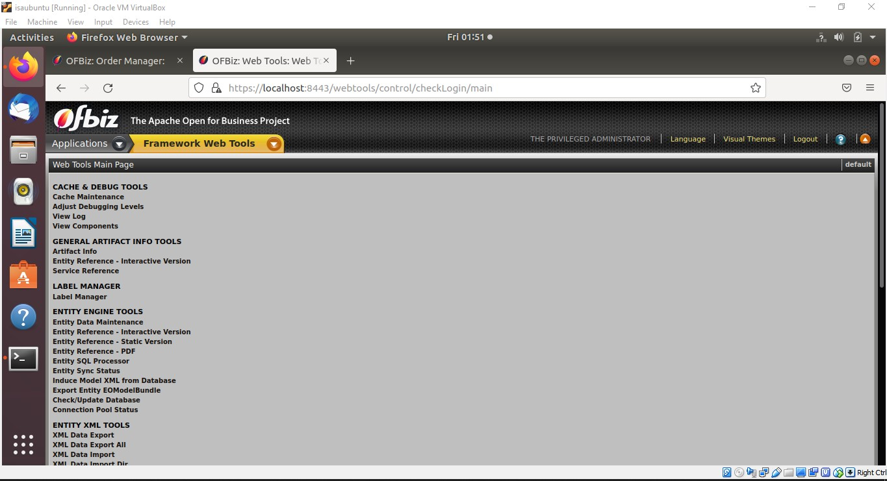

# Apache OFBiz Installation

### Install Packet yang dibutuhkan
Install paket Java dan Gradle
```bash
osboxes@isaanggi:~$ sudo apt-get install apt-transport-https ca-certificates wget dirmngr gnupg software-properties-common unzip -y
osboxes@isaanggi:~$ sudo apt-key adv --keyserver keyserver.ubuntu.com --recv-keys 8AC3B29174885C03
osboxes@isaanggi:~$ sudo add-apt-repository --yes https://adoptopenjdk.jfrog.io/adoptopenjdk/deb/
osboxes@isaanggi:~$ sudo apt-get install adoptopenjdk-8-hotspot -y
osboxes@isaanggi:~$ sudo apt-get install gradle
```

Setelah itu cek apakah sudah terinstall dengan baik.<br>
<br>

### Instalasi OFBiz
Download OFBiz, kemudian extract file yang telah didownload.
```bash
osboxes@isaanggi:~$ wget https://archive.apache.org/dist/ofbiz/apache-ofbiz-16.11.05.zip
osboxes@isaanggi:~$ unzip apache-ofbiz-16.11.05
osboxes@isaanggi:~$ cd apache-ofbiz-16.11.05
osboxes@isaanggi:~/apache-ofbiz-16.11.05$ sudo ./gradlew cleanAll loadDefault
```

Tunggu sampai proses instalasi selesai.<br>
<br>

### Akses OFBiz 
Jalankan service OFBiz, kemudian akses melalui browser. 
```bash
osboxes@isaanggi:~/apache-ofbiz-16.11.05$ sudo ./gradlew "ofbiz --load-data readers=seed"
osboxes@isaanggi:~/apache-ofbiz-16.11.05$ sudo ./gradlew "ofbiz --load-data readers=seed,seed-initial,ext"
osboxes@isaanggi:~/apache-ofbiz-16.11.05$ sudo ./gradlew ofbiz
```

Untuk login, user/password: admin/ofbiz<br>
Default dashboard: https://SERVER_IP:8443/ordermgr/control/main<br>
Catalog Manager: https://SERVER_IP:8443/catalog<br>
E-Commerce: https://SERVER_IP:8443/ecommerce<br>
WebTools: https://SERVER_IP:8443/webtools<br>

<br>
<br><br>
<br>
<br>
