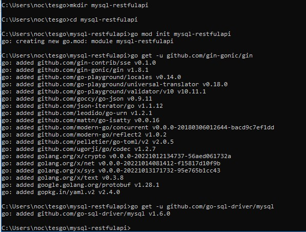
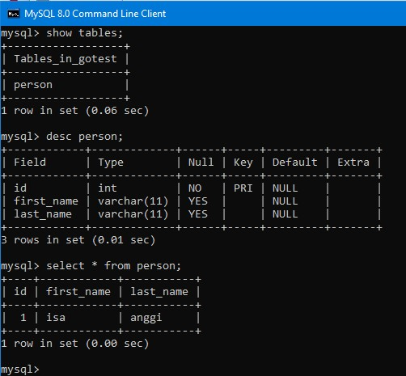
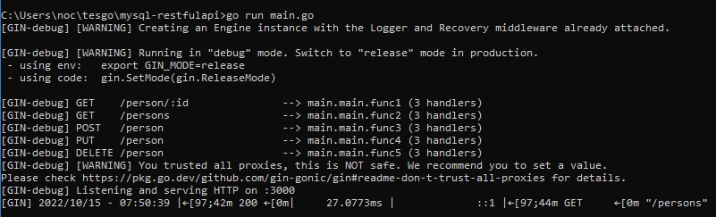
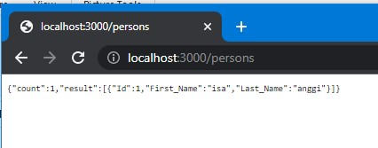
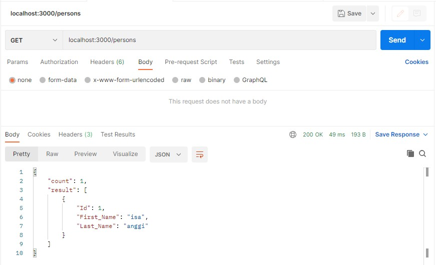
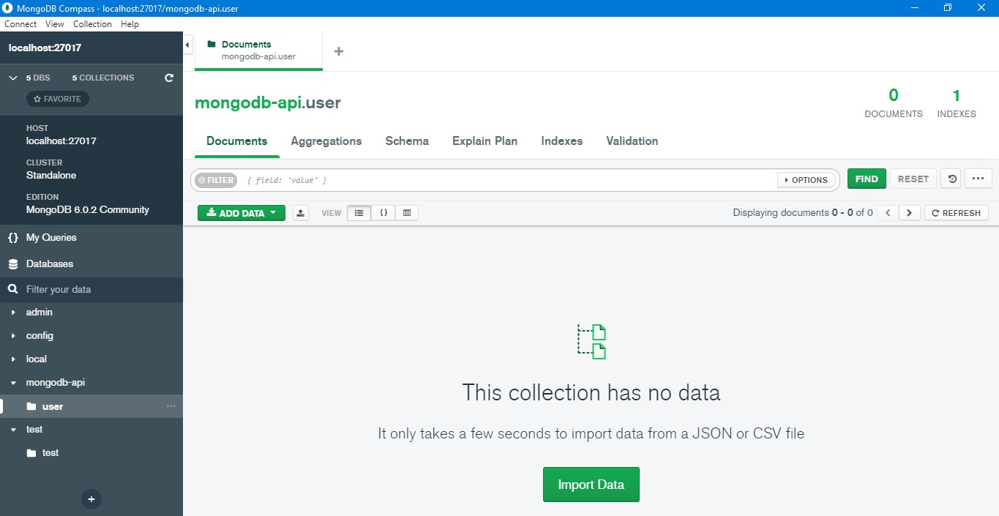
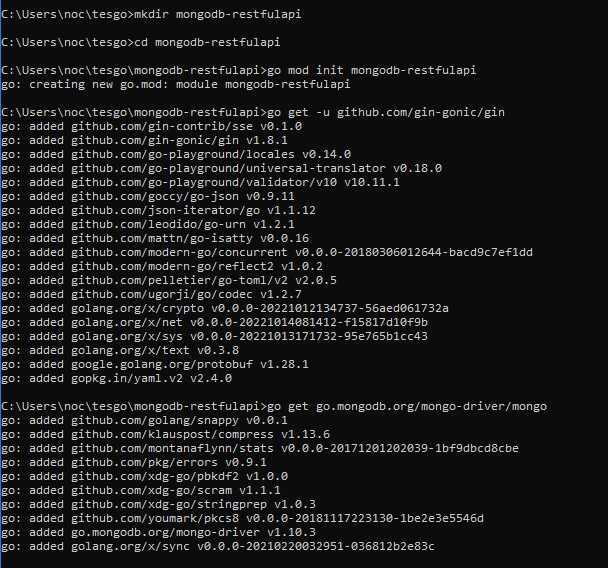
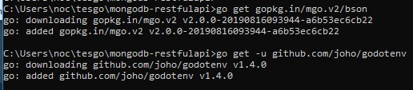

# Gin RESTful API membaca data dari MySQL dan MongoDB

## MySQL
1. Create direktori baru, kemudian instal module dan driver yang diperlukan.

 

2. Create database MySQL lalu masukan data kedalamnya.

3. Buat file program **main.go** untuk membaca data pada database yang telah dibuat.  
Kode program RESTful API untuk membaca data dari MySQL adalah sebagai [berikut](kode/latihan/restful-api-mysql/main.go) 

4. Jalankan program yang telah dibuat.

 

5. Selagi program berjalan, akses RESTful API melalui **web browser** atau **postman**

## MongoDB
1. Create database baru pada MongoDB.

 
2. Create direktori baru, kemudian instal module dan driver yang diperlukan. 

 

 
3. Buat file program **main.go** untuk membaca data pada database yang telah dibuat.  
Kode program RESTful API untuk membaca data dari MongoDB adalah sebagai [berikut](kode/latihan/restful-api-mongodb/main.go) 
