# Install Go, MySQL dan MongoDB

## Install Go 
1. Download GO Installer melalui [Golang](https://golang.org/doc/install)

2. Install GO dan Cek versinya.

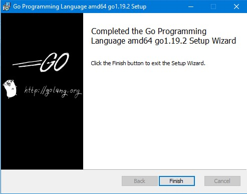
 

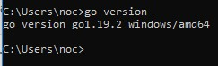

## Install MySQL
1. Download MySQL Installer melalui [MySQL](https://dev.mysql.com/downloads/installer/)

2. Install MySQL dan Cek versinya.

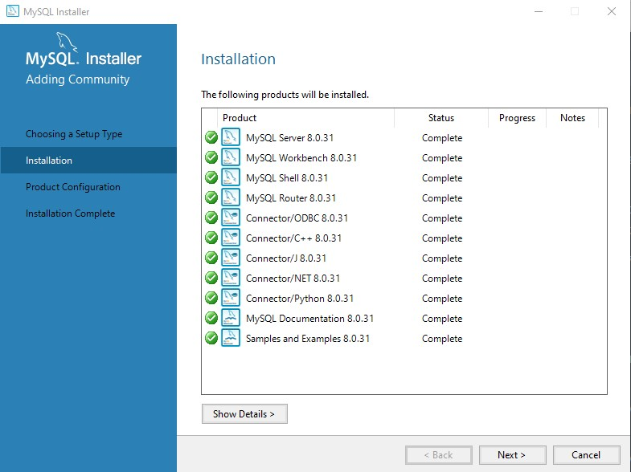
 

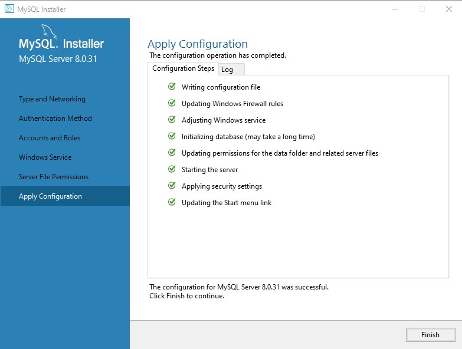
 

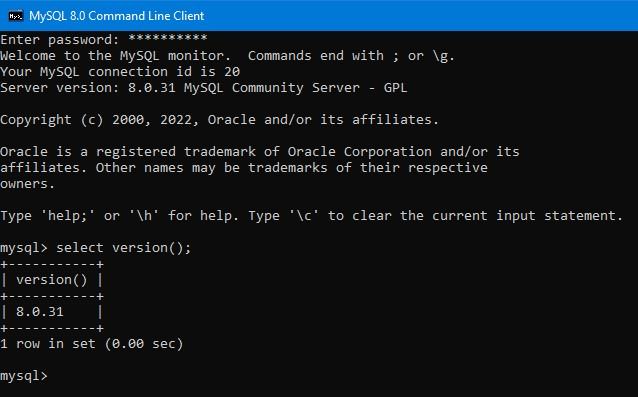

## Install MongoDB
1. Download MongoDB Installer melalui [MongoDB](https://www.mongodb.com/try/download/community?tck=docs_server)

2. Install MongoDB dan Cek versinya.

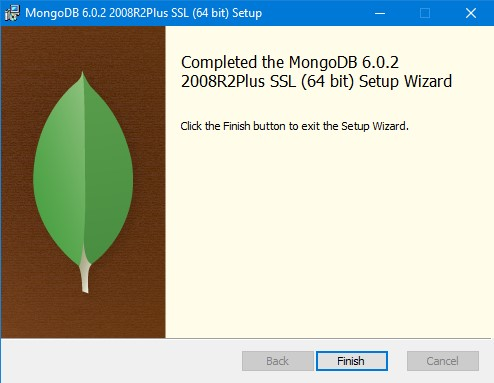
 

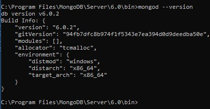

## Program Go untuk koneksi dan membaca data dari MySQL dan MongoDB
1. Create direktori baru, kemudian instal module dan driver yang diperlukan.

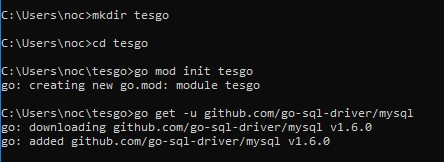
 

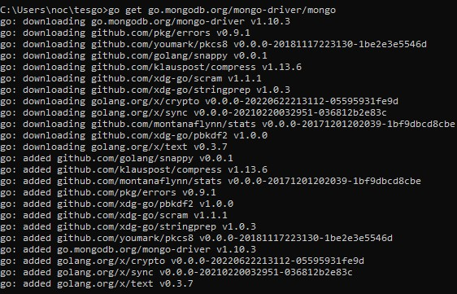
 

2. Create database MySQL dan MongoDB, lalu masukan data kedalamnya.

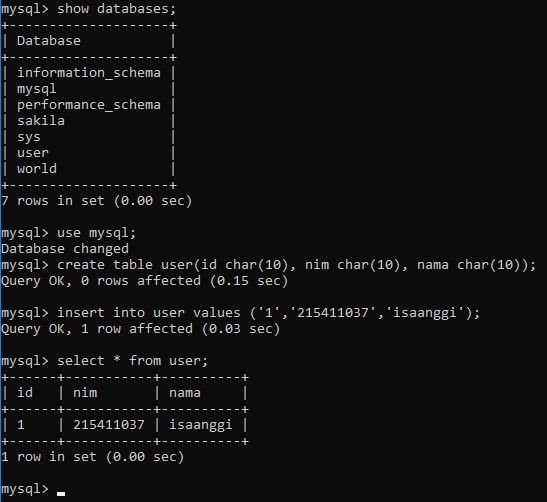
 

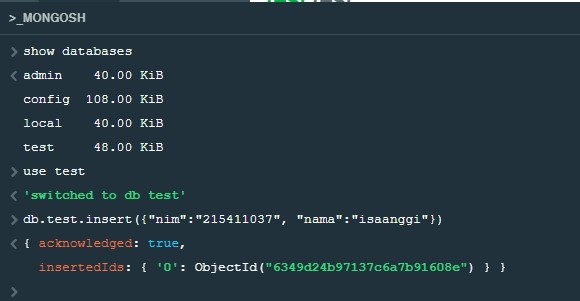
 

3. Buat file program dengan ekstensi .go untuk membaca data pada kedua database yang telah dibuat.   
Kode program untuk membaca data dari MySQL adalah sebagai [berikut](kode/latihan/mysql.go) 
Kode program untuk membaca data dari MongoDB adalah sebagai [berikut](kode/latihan/mongodb.go) 

4. Jalankan program yang telah dibuat.

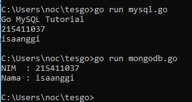
 

