# Docker Networking Hands-on Lab

Laporan beserta gambar dibawah ini adalah hasil praktikum melalui [Docker Networking Hands-on Lab](https://training.play-with-docker.com/docker-networking-hol/), sehingga untuk materi dan penjelasan lebih detailnya dapat diakses melalui web tersebut.

### Task

- [Section #1 - Networking Basics](https://github.com/isaanggi/tekn-cloud-computing/edit/main/minggu-10/docker-networking.md#section-1---networking-basics)
- [Section #2 - Bridge Networking](https://github.com/isaanggi/tekn-cloud-computing/edit/main/minggu-10/docker-networking.md#section-2---bridge-networking)
- Section #3 - Overlay Networking
- Cleaning Up

## Section #1 - Networking Basics

### Step 1: The Docker Network Command
The ```docker network``` command is the main command for configuring and managing container networks. Run the ```docker network``` command from the first terminal.
<div>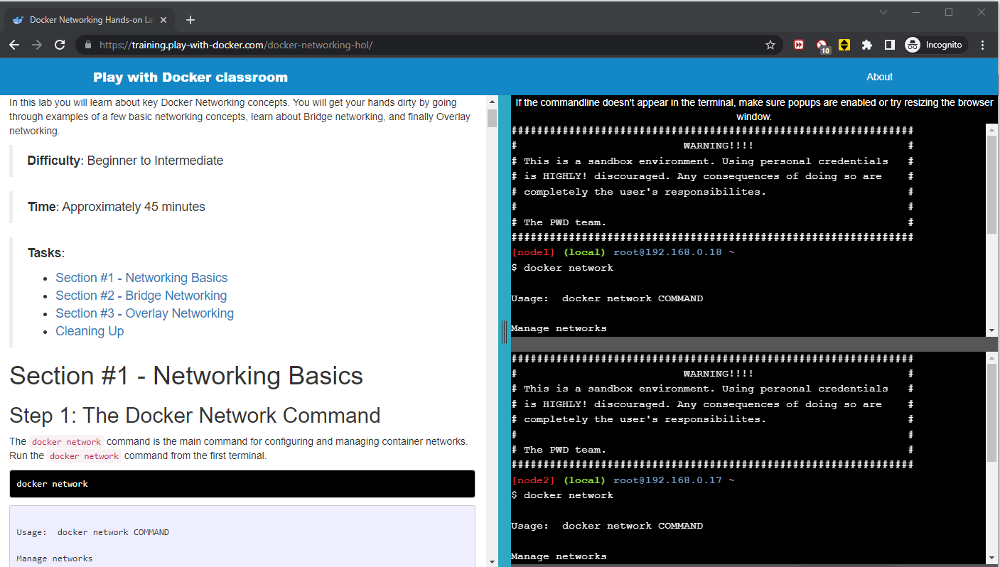</div>
<div>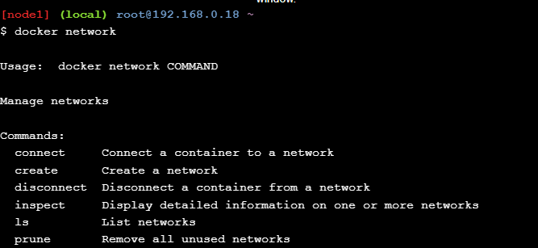</div>

### Step 2: List networks
Run a ```docker network ls``` command to view existing container networks on the current Docker host.
<div>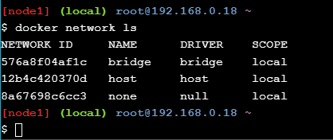</div><br>

### Step 3: Inspect a network
The ```docker network inspect``` command is used to view network configuration details. Use ```docker network inspect <network>``` to view configuration details of the container networks on your Docker host. The command below shows the details of the network called ```bridge```.
<div>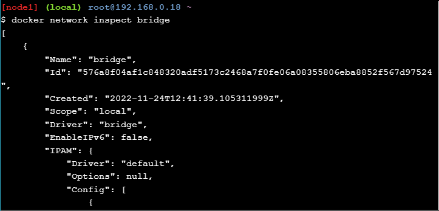</div><br>

### Step 4: List network driver plugins
The ```docker info``` command shows a lot of interesting information about a Docker installation. Run the ```docker info``` command and locate the list of network plugins.
<div>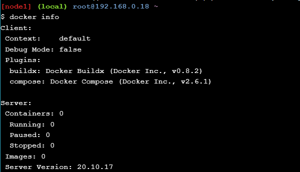</div><br>

## Section #2 - Bridge Networking
### Step 1: The Basics
Every clean installation of Docker comes with a pre-built network called bridge. Verify this with the docker ```network ls```.
<div>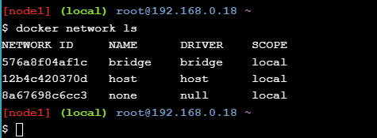</div><br>

Install the ```brctl``` command and use it to list the Linux bridges on your Docker host. You can do this by running ```sudo apt-get install bridge-utils```.
<div>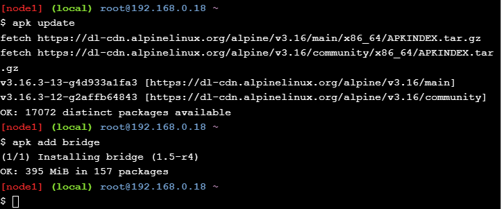</div><br>

Then, list the bridges on your Docker host, by running ```brctl show```. You can also use the ```ip a``` command to view details of the docker0 bridge.

<div>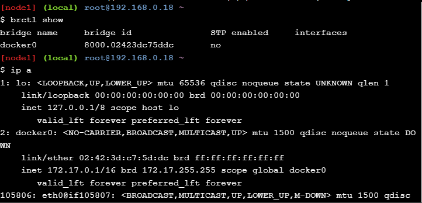</div><br>

### Step 2: Connect a container
The bridge network is the default network for new containers. This means that unless you specify a different network, all new containers will be connected to the bridge network. Create a new container by running ```docker run -dt ubuntu sleep infinity```. This command will create a new container based on the ```ubuntu:latest``` image and will run the ```sleep``` command to keep the container running in the background. You can verify our example container is up by running ```docker ps```.
<div>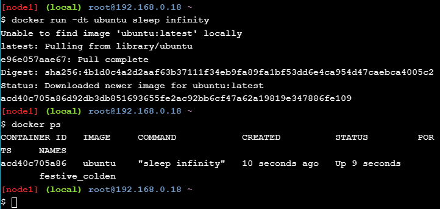</div><br>

As no network was specified on the ```docker run``` command, the container will be added to the bridge network. Run the ```brctl show``` command again. Notice how the docker0 bridge now has an interface connected. This interface connects the docker0 bridge to the new container just created. You can inspect the bridge network again, by running ```docker network inspect bridge```, to see the new container attached to it.
<div>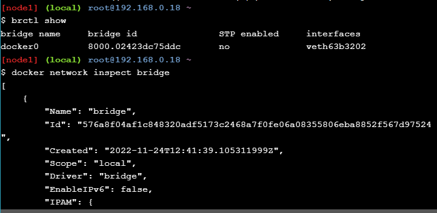</div><br>


COMMIT DULU :D

==============================================


<div>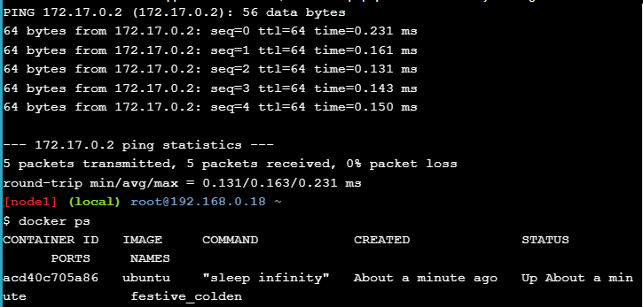</div><br>
<div>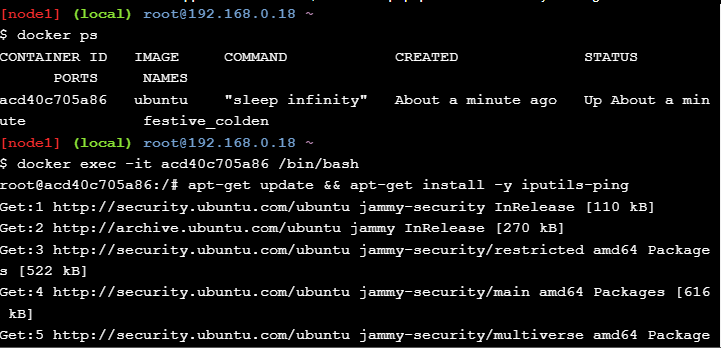</div><br>
<div>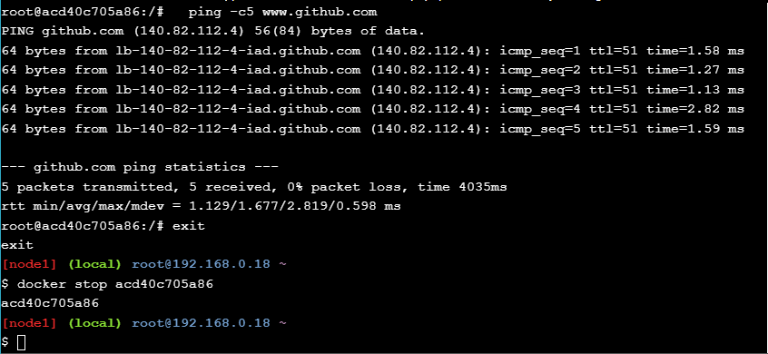</div><br>
<div>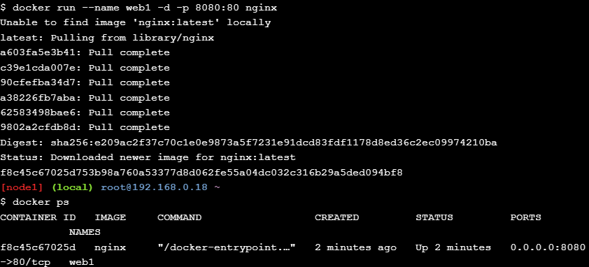</div><br>
<div>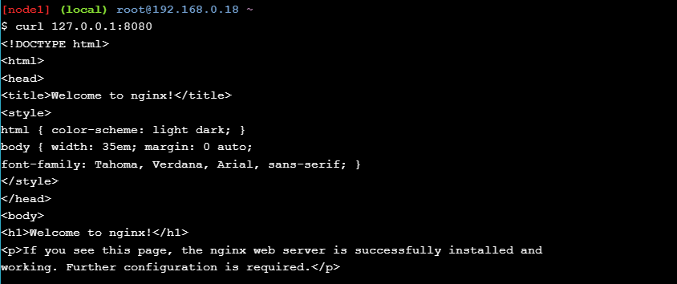</div><br>
<div>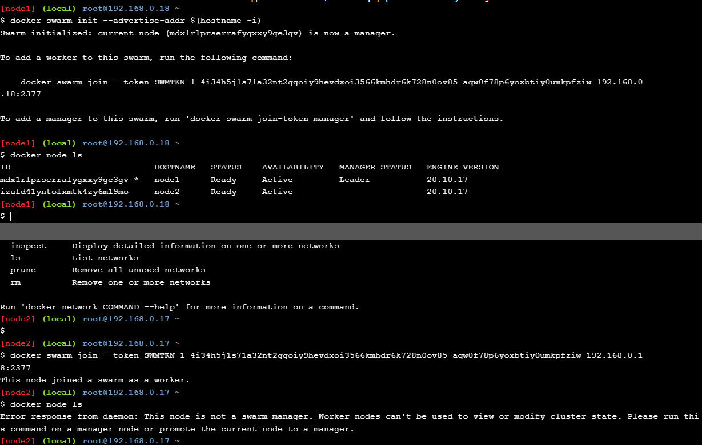</div><br>
<div>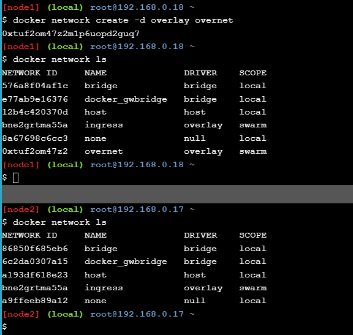</div><br>
<div>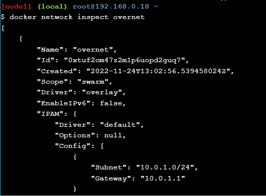</div><br>
<div>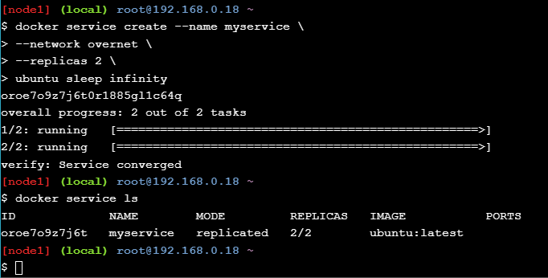</div><br>
<div>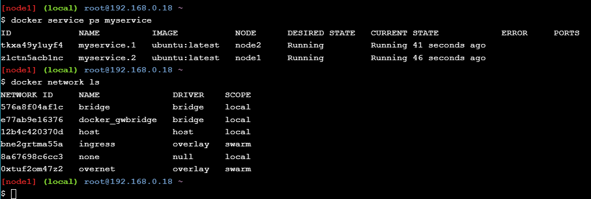</div><br>
<div>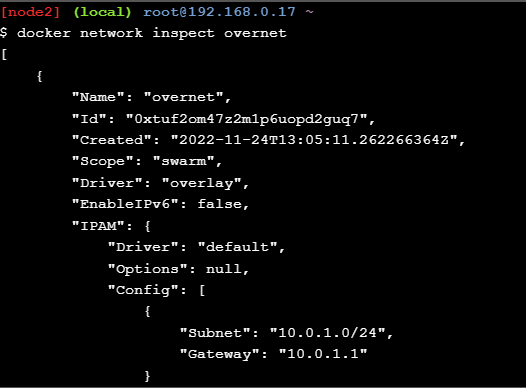</div><br>
<div>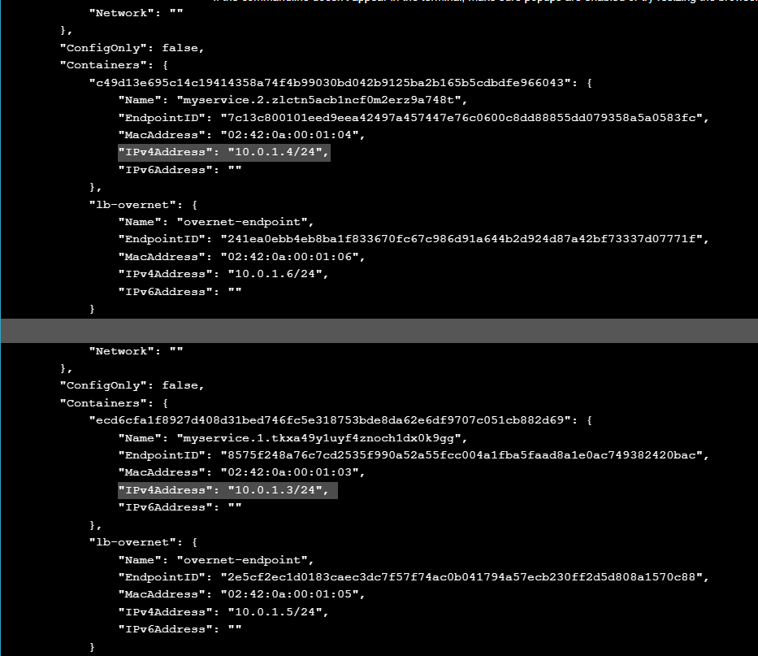</div><br>
<div>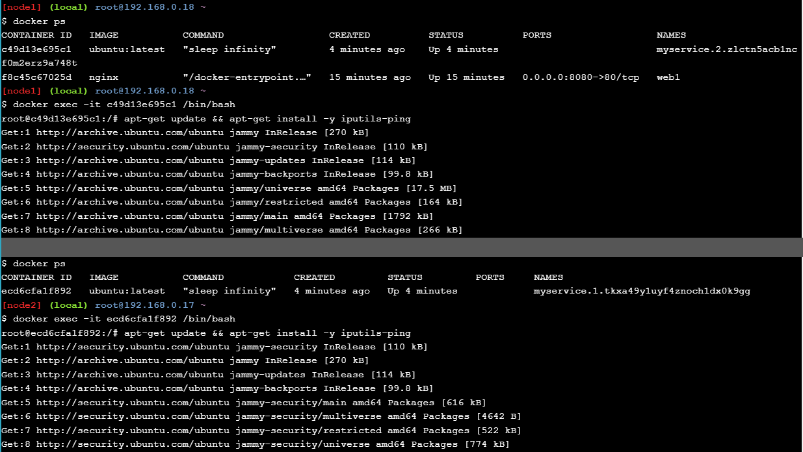</div><br>
<div>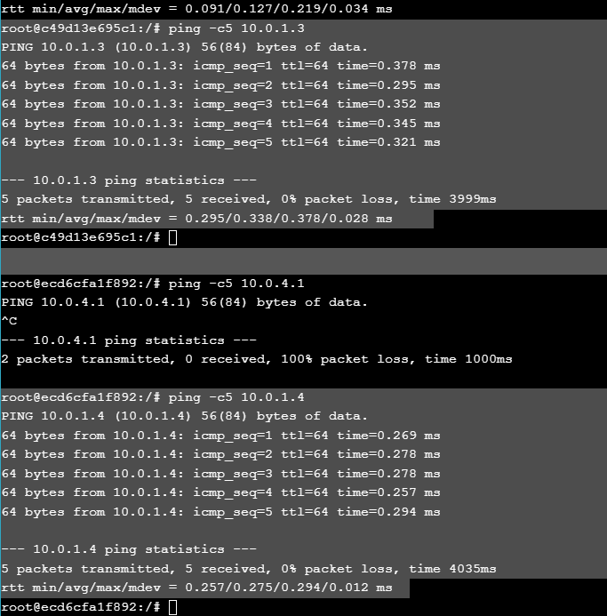</div><br>
<div>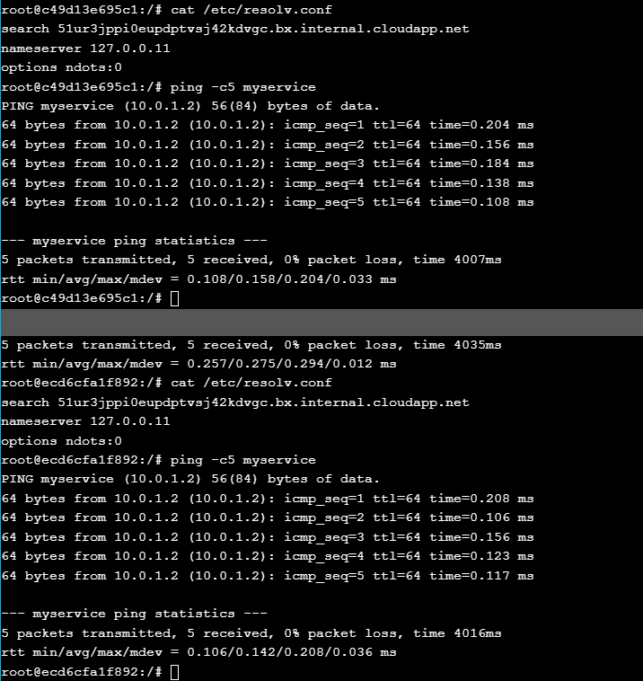</div><br>
<div>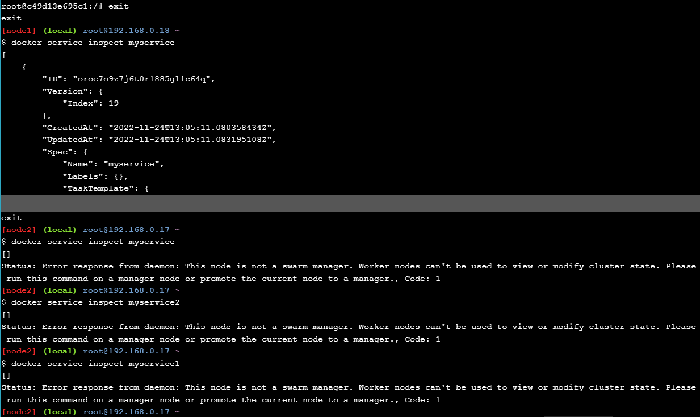</div><br>
<div>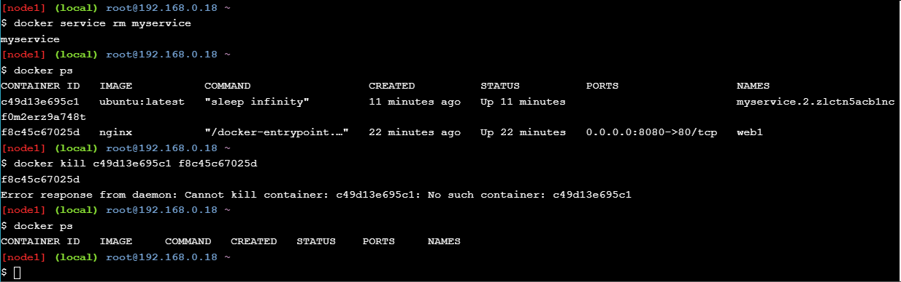</div><br>
<div>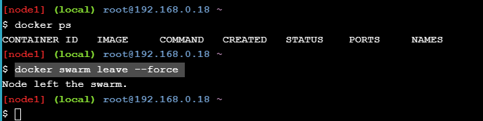</div><br>
<div>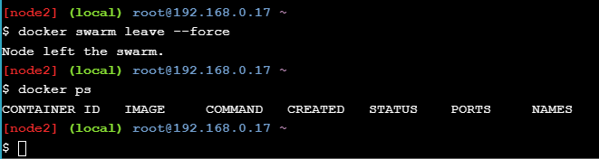</div><br>
