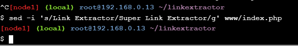

# Application Containerization and Microservice Orchestration

Laporan beserta gambar dibawah ini adalah hasil praktikum melalui [Application Containerization and Microservice Orchestration](https://training.play-with-docker.com/microservice-orchestration/), sehingga untuk materi dan penjelasan lebih detailnya dapat diakses melalui web tersebut.

### Steps

- [Stage Setup](app-containerization-orchestration.md#stage-setup)
- [Step 0: Basic Link Extractor Script](app-containerization-orchestration.md#step-0-basic-link-extractor-script)
- [Step 1: Containerized Link Extractor Script](app-containerization-orchestration.md#step-1-containerized-link-extractor-script)
- [Step 2: Link Extractor Module with Full URI and Anchor Text](app-containerization-orchestration.md#step-2-link-extractor-module-with-full-uri-and-anchor-text)
- [Step 3: Link Extractor API Service](app-containerization-orchestration.md#step-3-link-extractor-api-service)
- [Step 4: Link Extractor API and Web Front End Services](app-containerization-orchestration.md#step-4-link-extractor-api-and-web-front-end-services)
- [Step 5: Redis Service for Caching](app-containerization-orchestration.md#step-5-redis-service-for-caching)
- [Step 6: Swap Python API Service with Ruby](app-containerization-orchestration.md#step-6-swap-python-api-service-with-ruby)
- [Conclusions](app-containerization-orchestration.md#conclusions)

## Stage Setup

Let’s get started by first cloning the demo code repository, changing the working directory, and checking the ```demo``` branch out.

<div></div>
<div></div>

## Step 0: Basic Link Extractor Script

Checkout the ```step0``` branch and list files in it. The ```linkextractor.py``` file is the interesting one here, so let’s look at its contents:

<div></div>

However, this seemingly simple script might not be the easiest one to run on a machine that does not meet its requirements. The ```README.md``` file suggests how to run it, so let’s give it a try. When we tried to execute it as a script, we got the ```Permission denied``` error. Let’s check the current permissions on this file. This current permission ```-rw-r--r--``` indicates that the script is not set to be executable. We can either change it by running ```chmod a+x linkextractor.py``` or run it as a Python program instead of a self-executing script as illustrated below:

<div></div>

Here we got the first ```ImportError``` message because we are missing the third-party package needed by the script. We can install that Python package (and potentially other missing packages) using one of the many techniques to make it work, but it is too much work for such a simple script, which might not be obvious for those who are not familiar with Python’s ecosystem.

This is where application containerization tools like Docker come in handy. In the next step we will try to containerize this script and make it easier to execute.

## Step 1: Containerized Link Extractor Script

Checkout the ```step1``` branch and list files in it. We have added one new file (i.e., ```Dockerfile```) in this step. Let’s look into its contents:

<div></div>

Using this ```Dockerfile``` we can prepare a Docker image for this script. So far, we have just described how we want our Docker image to be like, but didn’t really build one. So let’s do just that:

<div></div>

We have created a Docker image named ```linkextractor:step1``` based on the ```Dockerfile``` illustrated above. If the build was successful, we should be able to see it in the list of image:

<div></div>

This image should have all the necessary ingredients packaged in it to run the script anywhere on a machine that supports Docker. Now, let’s run a one-off container with this image and extract links from some live web pages. This outputs a single link that is present in the simple ```example.com``` web page. Let’s try it on a web page with more links in it:

<div></div>

In the next step we will make these changes and some other improvements to the script.

## Step 2: Link Extractor Module with Full URI and Anchor Text

Checkout the step2 branch and list files in it.

<div></div>

In this step the ```linkextractor.py``` script is updated with the following functional changes. Let’s have a look at the updated script.

<div></div>

Let’s have a look at the updated script. We have used a new tag ```linkextractor:step2``` for this image so that we don’t overwrite the image from the ```step1``` to illustrate that they can co-exist and containers can be run using either of these images.

<div></div>

Running a one-off container using the ```linkextractor:step2``` image should now yield an improved output:

<div></div>

Running a container using the previous image linkextractor:step1 should still result in the old output:

<div></div>

So far, we have learned how to containerize a script with its necessary dependencies to make it more portable. We have also learned how to make changes in the application and build different variants of Docker images that can co-exist. In the next step we will build a web service that will utilize this script and will make the service run inside a Docker container.

## Step 3: Link Extractor API Service

<div></div>
<div></div>
<div></div>
<div></div>
<div></div>
<div></div>
<div></div>

## Step 4: Link Extractor API and Web Front End Services

<div></div>
<div></div>
<div></div>
<div></div>
<div></div>
<div></div>
<div></div>
<div></div>
<div></div>
<div></div>
<div></div>
<div></div>

## Step 5: Redis Service for Caching

<div></div>
<div></div>
<div></div>
<div></div>
<div></div>
<div></div>
<div></div>
<div></div>
<div></div>
<div></div>
<div></div>
<div></div>
<div></div>
<div></div>

## Step 6: Swap Python API Service with Ruby

<div></div>
<div></div>
<div></div>
<div></div>
<div></div>
<div></div>
<div></div>
<div></div>

## Conclusions

We started this tutorial with a simple Python script that scrapes links from a given web page URL. We demonstrated various difficulties in running the script. We then illustrated how easy to run and portable the script becomes onces it is containerized. In the later steps we gradually evolved the script into a multi-service application stack. In the process we explored various concepts of microservice architecture and how Docker tools can be helpful in orchestrating a multi-service stack. Finally, we demonstrated the ease of microservice component swapping and data persistence.
